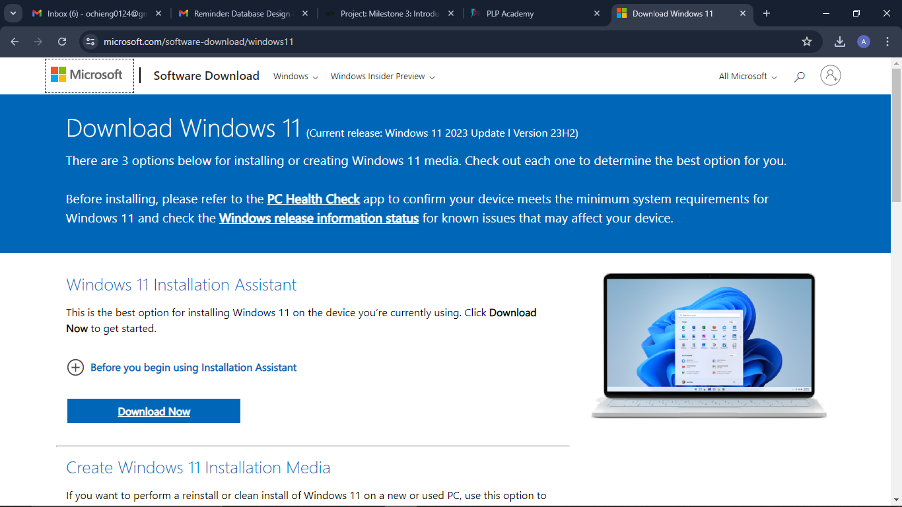

**Installing Windows 11**

To install Windows 11, head to: https://www.microsoft.com/software-download/windows11

At this page, select the option that suits the operation that you would like to perform.

 1. *Create Windows 11 Installation Media*
    *If you want to perform a reinstall or clean install of Windows 11 on a new or used PC, use this option to download the media creation tool to make a bootable USB or DVD.*
 2. *Download Windows 11 Disk Image (ISO) for x64 devices*
    *This option is for users that want to create a bootable installation media (USB flash drive, DVD) or create a virtual machine (.ISO file) to install Windows 11. This download is a multi-edition ISO which uses your product key to unlock the correct edition.*

If you chose to go with option two, follow these steps:

 

  Choose (select download) and choose (Windows 11 (Multi-edition ISO for x64 devices) ) then click download now.

 
 Select your preffered language. For our case we choose, English International.

 
Click the '64-bit Download' button.

Wait for your download to complete. You can track your download progress by pressing the download icon. 

When the download is complete,

    Open File Explorer.

    Open the folder location for the ISO file.

    Right-click the ISO file and select the Mount option.

    Click on the mounted drive from the left navigation pane.

    Double-click the Setup file to begin the Windows 11 23H2 upgrade process.

    (Optional) Click the “Change how Windows Setup downloads updates” option. 

    

    Select the “Not right now” option.

  
    Click the Next button.

    Click the Accept button to agree to the terms.

  
    Click the Install button.
    Once you complete the steps, Windows 11 will install on your desktop or laptop.

**Installing a text editor (VSC)**
To download Visual Studio Code, use the following link: https://code.visualstudio.com/download
   

Click the installer button that suits your needs. In our case, we select windows installer.
   

Your download should start automatically. You can track your download progress by clicking the download icon. 
   

    Once the download completes, locate it by clicking on the ⊞ Start Button and type ‘File Explorer’. Launch File Explorer:
  

    On the left side of the File Explorer window, locate and click on Downloads. Double-click on the downloaded 'VSCodeUserSetup-x64-1.x.x.exe file:
 

    Once the installer launches, step through the installation process. First, accept the License Agreement, then click Next >
 

    You should continue by selecting the necessary settings/preferences for you then click next.

    Confirm the installation options, then click Install.
 

    The installation will proceed.
    Click Finish to exit the installation and (by default) launch Visual Studio Code:
 

**Setting up a version control system (Git and GitHub)**

To download Git, head to the download website via the following link: https://git-scm.com/downloads
 
    Choose your preferred installer, in our case we will choose 'Download for Windows' shown on the monitor.
    The link contains the latest 64-bit Git version for Windows. Alternatively, if you use a 32-bit system, download the 32-bit Git installer.

    Double-click the downloaded file to extract and launch the installer.

    Review the GNU General Public License, and when you are ready to install, click Next.
 

    The installer prompts you for an installation location. Leave the default one unless you want to change it, and click Next.
 

     In the component selection screen, leave the defaults unless you need to change them and click Next.

    Select a text editor you want to use with Git. Use the drop-down menu to select Notepad++ (or whichever text editor you prefer) and click Next.
 

    The next step allows you to choose a different name for your initial branch. The default is master. Unless you are working in a team that requires a different name, leave the default option and click Next.
 

    The next step allows you to change the PATH environment. The PATH is the default set of directories included when you run a command from the command line. Keep the middle (recommended) selection and click Next.
 

    The installer prompts you to select the SSH client for Git to use. Git already comes with its own SSH client, so if you don't need a specific one, leave the default option and click Next.
 

    The next option relates to server certificates. The default option is recommended for most users. If you work in an Active Directory environment, you may need to switch to Windows Store certificates. Select your preferred option and click Next.
 

    The following selection configures line-ending conversion, which relates to the way data is formatted. The default selection is recommended for Windows. Click Next to proceed.
 

    Choose the terminal emulator you want to use. The default MinTTY is recommended for its features. Click Next to continue.
 

    The next step allows you to choose what the git pull command will do. The default option is recommended unless you specifically need to change its behavior. Click Next to continue with the installation.
 

    The next step is to choose which credential helper to use. Git uses credential helpers to fetch or save credentials. The default option is the most stable one. Select your preferred credential manager and click Next.
 

    The next step lets you decide which extra options to enable. If you use symbolic links, which represent shortcuts for the command line, tick the box. Keep file system caching checked and click Next.
 

    Depending on which Git version you are installing, it may offer to install experimental features. At the time this article was written, the installer offered options to include support for pseudo controls and a built-in file system monitor. For the most stable operation, do not install experimental features and click Install.
 

    Once the installation is complete, tick the boxes to view the Release Notes or launch Git Bash if you want to start using Git right away, and click Finish.
 

**Git Setup**
Now that you have Git on your system, you’ll want to do a few things to customize your Git environment.

Your Identity
The first thing you should do when you install Git is to set your user name and email address. This is important because every Git commit uses this information, and it’s immutably baked into the commits you start creating:

                $ git config --global user.name "John Doe"
                $ git config --global user.email johndoe@example.com

Your Editor
Now that your identity is set up, you can configure the default text editor that will be used when Git needs you to type in a message. If not configured, Git uses your system’s default editor.

If you want to use a different text editor, such as visual studio code, you can do the following:

                $ git config --global core.editor code

Checking Your Settings
If you want to check your configuration settings, you can use the git config --list command to list all the settings Git can find at that point:

                $ git config --list
                user.name=John Doe
                user.email=johndoe@example.com

Getting Help
If you ever need help while using Git, there are three equivalent ways to get the comprehensive manual page (manpage) help for any of the Git commands:

                $ git help 

**GitHub**
The first thing you need to do is set up a free user account. Simply visit https://github.com, choose a user name that isn’t already taken, provide an email address and a password, and click the big green “Sign up for GitHub” button.
 

The way that GitHub maps your Git commits to your user is by email address. Therefore it is essential to add your email; Use the same email as the one you used in Git Bash. 

Creating a New Repository
Start by clicking the “New repository” button on the right-hand side of the dashboard, or from the + button in the top toolbar next to your username as seen in The “New repository” dropdown.

Name your repository, save it as public then proceed to create a new repository. 
 

Once your repository has been create, tap 'code', and copy the code.
 

**Cloning your repository**
Once you have copied the code; open Git Bash (Remember to run it in admin mode).
Type the following code to clone your remote repository on to your local repository:
            git clone *code from your remote repo*
To track the changes in your file initialize git in your directory.
            cd *Your preferred repository*
            git init.

**Installing Python**
To install Python, head over to the official Python download website through the following link: https://www.python.org/downloads/
 

Click "download Python 3.12.4" to initialize the download. You can track your download progress by clicking the download icon.

Next, run the .exe file that you just downloaded, and then follow the installation instructions.
When it is done installing, click finish.

In the Windows search bar, type in python.exe, but don’t click on it in the menu. Instead, right-click on it, and select Open file location 
 

A window will open up with some files and folders: this should be where Python is installed. Right-click on the address bar at the top and select Copy address as text.
 

In the search box on the top right, type in environment, and in the search results, click on Edit environment variables for your account:
 

If there is already a variable listed called Path, click on it to select it, then click Edit…. If it does not exist, instead click New….
 

If your pop-up box looks like the image below, click New and then paste in the address you just copied. Then click New again, paste in the address again, and add Scripts\ at the end. Click OK twice to finish editing your environment variables.
 

Now that you can use Python from the command line, you can use pip! The following instructions should work for Python version 3.4 and above. If you are using an older version of Python, you can upgrade Python via the Python website.

In the command prompt window, type the following command to upgrade pip:

                python -m pip install -U pip
                Other pip commands

    Upgrade an already installed module
                pip install --upgrade name_of_module
    Uninstall a module:
                pip uninstall name_of_module
    List installed modules:
                pip list

**MySQL**
To download the MySQL community server, head to: https://dev.mysql.com/downloads/mysql/ 

1. "Choosing a Setup Type" screen: Choose "Full" setup type. This installs all MySQL products and features. Then click the "Next" button to continue.

2. "Check Requirements" screen: The installer checks if your pc has the requirements needed. If there is some failing requirements, click on each item to try to resolve them by clicking on the Execute button that will install all requirements automatically. Click "Next".

3. "Installation" screen: See what products that will be installed. Click "Execute" to download and install the Products. After finishing the installation, click "Next".

4. "Product Configuration" screen: See what products that will be configured. Click the "MySQL Server 8.0.23" option to configure the MySQL Server. Click the "Next" button. Choose the "Standalone MySQL Server/Classic MySQL Replication" option and click on the "Next" button. In page  "Type and Networking" set Config Type to "Development Computer" and "Connectivity" to "TCP/IP" and "Port" to "3006". Then, click the "Next" button.

5. "Authentication Method" screen: Choose "Use Strong Password Encryption for Authentication". Click "Next".

6. "Accounts and Roles" screen: Set a password for the root account. Click "Next".

7. "Windows Service" screen: Here, you configure the Windows Service to start the server. Keep the default setup, then click "Next".

8. "Apply Configuration" screen: Click the "Execute" button to apply the Server configuration. After finishing, click the "Finish" button.

9. "Product Configuration" screen: See that the Product Configuration is completed. Keep the default setting and click on the "Next" and "Finish" button to complete the MySQL package installation.

10. In the next screen, you can choose to configure the Router. Click on "Next", "Finish" and then click the "Next" button.

11. "Connect To Server" screen: Type in the root password (from step 6). Click the "Check" button to check if the connection is successful or not. Click on the "Next" button.

12. "Apply Configuration" screen: Select the options and click the "Execute" button. After finishing, click the "Finish" button.

13. "Installation Complete" screen: The installation is complete. Click the "Finish" button.

